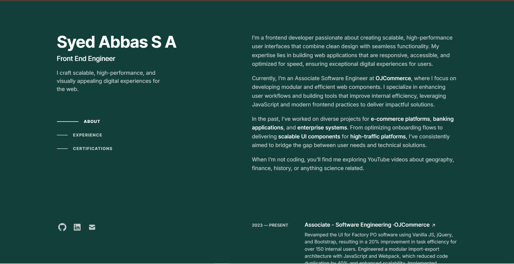

# Portfolio Website  

A fully responsive and interactive **portfolio website** built using **React** and **Tailwind CSS** to showcase my projects, certifications, skills, and experience. This project is designed to highlight my frontend development expertise and serve as a one-stop destination for recruiters and collaborators to learn more about me.  

## ✨ Features  

- **Dynamic Components:**  
  Modular React components such as `NavItem`, `SkillList`, `ExperienceCard`, and `ProjectDetailCard` to ensure scalability and reusability.  

- **Responsive Design:**  
  Built with **Tailwind CSS** to provide a seamless user experience across devices.  

- **Accessibility:**  
  Follows accessibility best practices to ensure inclusivity.  

- **Optimized Performance:**  
  Code splitting and minimal dependencies for fast loading and efficient performance.  

## ⚙️ Tech Stack  

- **React:** For building a modular and reusable component-based architecture.  
- **Tailwind CSS:** For utility-first styling and responsive design.   
- **Bun.js:** A fast all-in-one JavaScript runtime for optimized bundling and performance.  

## 🚀 Getting Started  

### Prerequisites  
- Node.js (v16+)  
- Bun.js  

### Installation  

1. Clone the repository:  
   ```bash  
   git clone https://github.com/yourusername/portfolio.git  
   ```  

2. Navigate to the project directory:  
   ```bash  
   cd portfolio  
   ```  

3. Install dependencies using **Bun**:  
   ```bash  
   bun install  
   ```  

4. Start the development server:  
   ```bash  
   bun dev  
   ```  

5. Open [http://localhost:3000](http://localhost:3000) in your browser to view the website.  

## 📸 Preview  



## 🛠️ Planned Future Enhancements   

- Add blog integration to showcase articles and technical writings.  
- Implement light and dark mode toggle.  
- Expand with backend features using **Node.js** and **Express.js** for handling contact forms and dynamic content.  

## 🤝 Connect  

Feel free to connect with me for feedback, or opportunities!  

- LinkedIn: [My LinkedIn Profile](https://www.linkedin.com/in/syedabbassa/)  
- Portfolio: [Live Portfolio Link](https://syedabbas.vercel.app/)  
